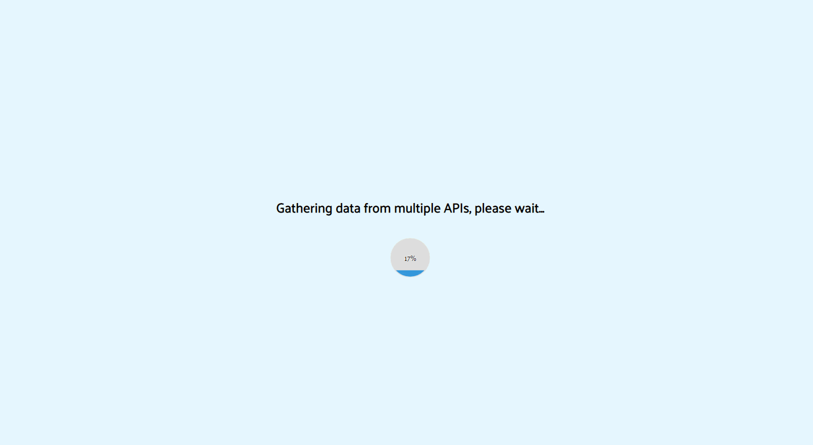
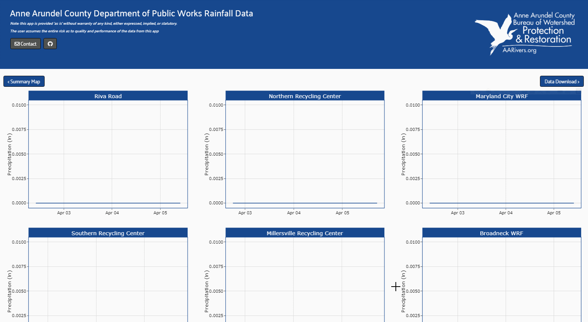

# Rainfall Dashboard

The rainfall dashboard, currently in development, can be found [here](https://wprp.shinyapps.io/RainfallDashboard/).  The app queries several APIs that contain monitoring data and pulls the last 72 hours for mapping and plotting.  The app also allows the user to query the APIs and download 30-days of data at a time. 

The app initially takes a few minutes to load but then will show an interactive map where you can review the 24-hr and 72-hr rainfall totals at each monitoring location: 

Then the you can view the timeseries plots as well as make requests to download the data from each API.  The data can also be plotted as a timeseries heatmap: 

